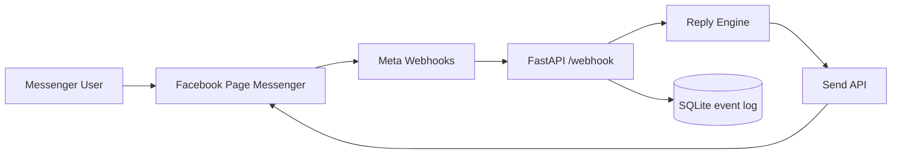

# Messenger Page Auto Reply Bot

Facebook Messenger を安全に自動化するための **Facebookページ向け** 自動返信Botです。

このリポジトリは、個人アカウントのMessenger受信箱をスクレイピングしたり、非公開API・非公開GraphQL・ブラウザDOM・Cookieを使って読み取るものではありません。Metaが公式に提供している Messenger Platform / Webhooks / Send API の範囲で、ページ宛のメッセージを受信し、自動返信します。

## 重要な結論

- ✅ 自動化できる: Facebookページ、またはビジネス利用のMessenger Platformに届くメッセージのWebhook受信と返信。
- ✅ 実装済み: FastAPI Webhook、署名検証、SQLiteログ、ルール返信、Send API送信、ローカルシミュレータ、テスト、CI。
- ❌ 実装しない: 個人Messenger受信箱の自動読み取り、ブラウザ操作によるDOMスクレイピング、非公開エンドポイント、Cookie流用、CAPTCHA/制限回避。

## 本番で必要なもの

1. Facebookページ
2. Meta Developer App
3. Messenger Platform / Messenger API の設定
4. Page Access Token
5. Webhook Verify Token
6. HTTPSで公開されたこのアプリのURL
7. 必要に応じて App Secret

## 環境変数

`.env.example` をコピーして設定します。

```bash
cp .env.example .env
```

| 変数 | 必須 | 説明 |
|---|---:|---|
| `VERIFY_TOKEN` | yes | Meta Developer ConsoleのWebhook検証用トークン。任意の長い文字列。 |
| `PAGE_ACCESS_TOKEN` | yes | Facebookページのアクセストークン。 |
| `PAGE_ID` | yes | FacebookページID。Send APIの送信先エンドポイントに使います。 |
| `GRAPH_API_VERSION` | no | 例: `v25.0`。 |
| `APP_SECRET` | no | Meta App Secret。設定すると `X-Hub-Signature-256` を検証します。 |
| `AUTO_REPLY_ENABLED` | no | `true` なら返信文を生成します。 |
| `SEND_REAL_MESSAGES` | no | `true` なら実際にMessengerへ送信、`false` ならdry-run。 |
| `DATABASE_URL` | no | SQLite保存先。既定は `sqlite:///./messenger_events.db`。 |

## ローカル起動

```bash
python -m venv .venv
source .venv/bin/activate
pip install -e '.[dev]'
cp .env.example .env
uvicorn app.main:app --reload --port 8000
```

Webhook確認:

```bash
curl 'http://localhost:8000/webhook?hub.mode=subscribe&hub.verify_token=change-me&hub.challenge=hello'
```

ローカルで疑似Webhookを送る:

```bash
python scripts/simulate_webhook.py --url http://localhost:8000/webhook --text '料金を教えて'
```

## Meta側の設定概要

詳しい手順は [`docs/setup.md`](docs/setup.md) を見てください。

1. Meta for Developers でアプリを作成
2. Messenger Platform / Messenger API を追加
3. Facebookページを接続
4. `pages_messaging` 権限で Page Access Token を発行
5. Webhook URL を `https://YOUR-DOMAIN/webhook` に設定
6. Verify Token に `.env` の `VERIFY_TOKEN` と同じ値を入力
7. Webhook subscription に `messages` と必要なイベントを追加
8. App Review が必要な場合は審査へ進む

## API

### `GET /health`

```json
{"ok": true, "service": "messenger-page-auto-reply-bot"}
```

### `GET /webhook`

MetaのWebhook検証用エンドポイントです。

### `POST /webhook`

Meta Webhooksから送られるイベントを受信します。

## テスト

```bash
ruff check .
pytest -q
```

## アーキテクチャ



詳細は [`docs/architecture.md`](docs/architecture.md) を見てください。

## 参考調査

- [`docs/research.md`](docs/research.md): 自動化できる範囲、できない範囲、裏技候補のリスク、採用した実装方針。
- [`docs/setup.md`](docs/setup.md): 初期設定手順。

## ライセンス

MIT
