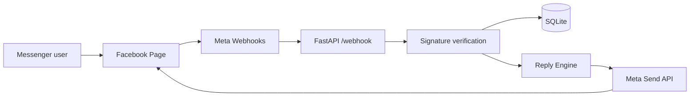

# Architecture

## 目的

Facebookページに届いたMessengerメッセージを、Meta公式のMessenger Platformで受け取り、自動返信する安全な最小構成です。

## 構成要素

- **Meta Webhooks**: ページ宛メッセージをリアルタイム通知します。
- **FastAPI app**: `/webhook` でWebhook検証とイベント受信を行います。
- **Reply Engine**: 受信テキストに対して保守的なルール返信を作ります。
- **Send API client**: Page Access Tokenを使い、公式Send APIで返信します。
- **SQLite**: 受信イベント、返信文、送信ステータスを保存します。
- **GitHub Actions**: lint、test、テストレポートartifactを実行します。

## Mermaid

## データフロー

1. 利用者がFacebookページへメッセージを送る。
2. MetaがWebhookイベントをこのアプリの `/webhook` にPOSTする。
3. `APP_SECRET` が設定されていれば `X-Hub-Signature-256` を検証する。
4. テキスト本文を `Reply Engine` に渡す。
5. `SEND_REAL_MESSAGES=true` の場合、Send APIで返信する。
6. 受信内容、返信内容、送信ステータスをSQLiteへ保存する。

## セキュリティ境界

- Page Access Tokenは環境変数またはホスティング基盤のSecretに保存します。
- 個人アカウントCookie、ブラウザセッション、非公開APIは使いません。
- App Secretを設定するとWebhook署名を検証できます。
- ログDBに個人情報が入り得るため、保存期間・閲覧権限・削除手順を本番前に決めてください。

## 拡張案

- FAQ/CRM連携
- 人間へのエスカレーション
- NGワード・個人情報マスキング
- RedisまたはPostgreSQLへの移行
- 承認済みテンプレート返信
- App Review用の操作動画とテストユーザー整備
