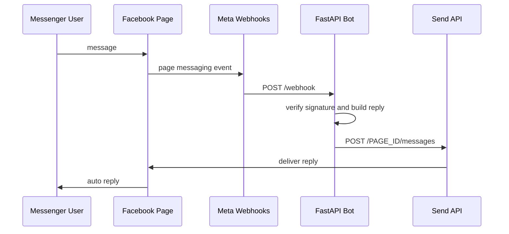

# Messenger自動化 調査メモ

調査日: 2026-06-15

## 結論

Facebook Messengerの自動化は、公式には **Facebookページまたはビジネスアカウント向けのMessenger Platform** を使うのが現実的です。個人アカウントのMessenger受信箱をAPIで丸ごと読み、自動返信する公式手段は見当たりません。

## 公式にできること

- Webhooksでページ宛のメッセージイベントを受信する。
- Page-scoped user IDに対してSend APIで返信する。
- `pages_messaging` 権限と Page Access Token を使う。
- 標準メッセージング期間、マーケティングメッセージ、Private RepliesなどのMetaポリシー内で送信する。

## このリポジトリで採用した方法

## 裏技候補と判断

| 候補 | 技術的可能性 | 採用判断 | 理由 |
|---|---|---|---|
| messenger.comをPlaywright/Seleniumで操作 | 可能な場合あり | 不採用 | 個人セッションCookie利用、DOM変更に弱い、アカウント制限リスク、Metaの自動収集禁止に触れる恐れ。 |
| 非公開GraphQL/モバイルAPIの解析 | 可能な場合あり | 不採用 | 非公開APIのリバースエンジニアリング、トークン流用、制限回避に近い。 |
| ブラウザ拡張で画面のメッセージを読む | 可能な場合あり | 不採用 | 利用者・相手のプライバシーと規約リスクが高い。 |
| Android Notification Listenerで通知を読む | 部分的に可能 | 不採用 | 通知に表示された断片しか読めず、返信の信頼性が低い。個人DM自動化の迂回策になり得る。 |
| Meta公式Messenger Platform | 可能 | 採用 | 権限・Webhook・Send API・審査の枠組みがあり、本番運用しやすい。 |

## 実装上の注意

- `SEND_REAL_MESSAGES=false` でdry-run確認してから本番送信を有効化する。
- 返信は24時間標準メッセージングウィンドウ等、Metaのポリシーに従う。
- マーケティングメッセージはユーザーのopt-inが必要。
- `APP_SECRET` を使ってWebhook署名を検証する。
- メッセージ本文は個人情報を含む可能性があるため、ログ保存期間と削除手順が必要。

## 参考URL

- Meta Messenger Platform: https://developers.facebook.com/docs/messenger-platform/
- Webhooks for Messenger Platform: https://developers.facebook.com/documentation/business-messaging/messenger-platform/webhooks
- Send API: https://developers.facebook.com/docs/messenger-platform/reference/send-api/
- Messenger Platform Policy: https://developers.facebook.com/documentation/business-messaging/messenger-platform/policy
- Graph API changelog: https://developers.facebook.com/docs/graph-api/changelog/
- Automated Data Collection Terms: https://www.facebook.com/legal/automated_data_collection_terms
